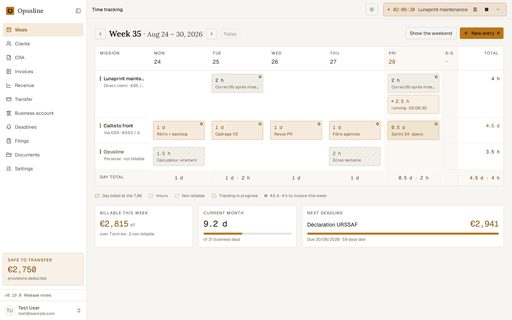
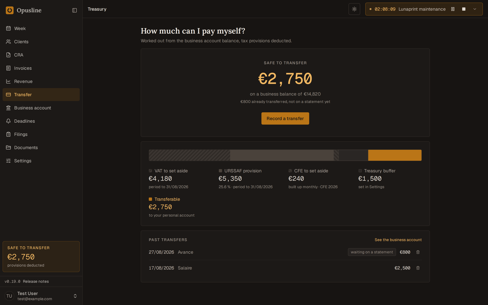
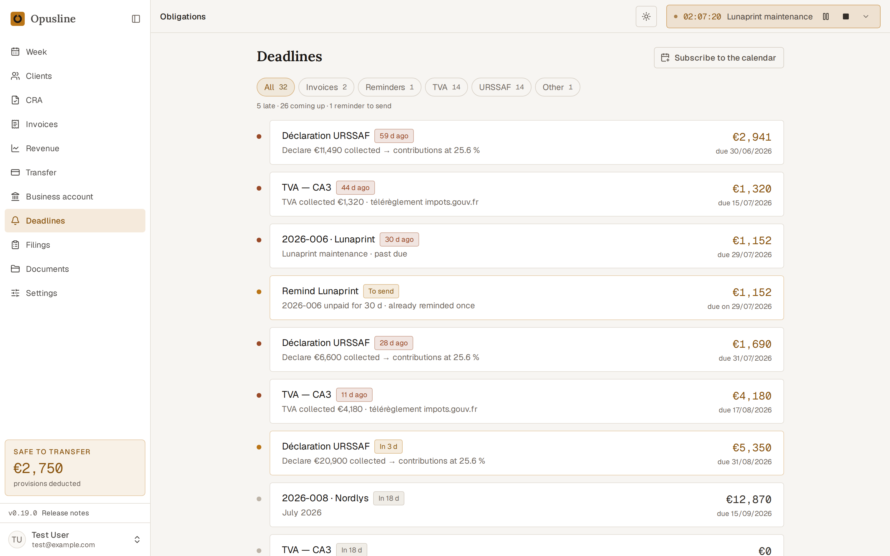
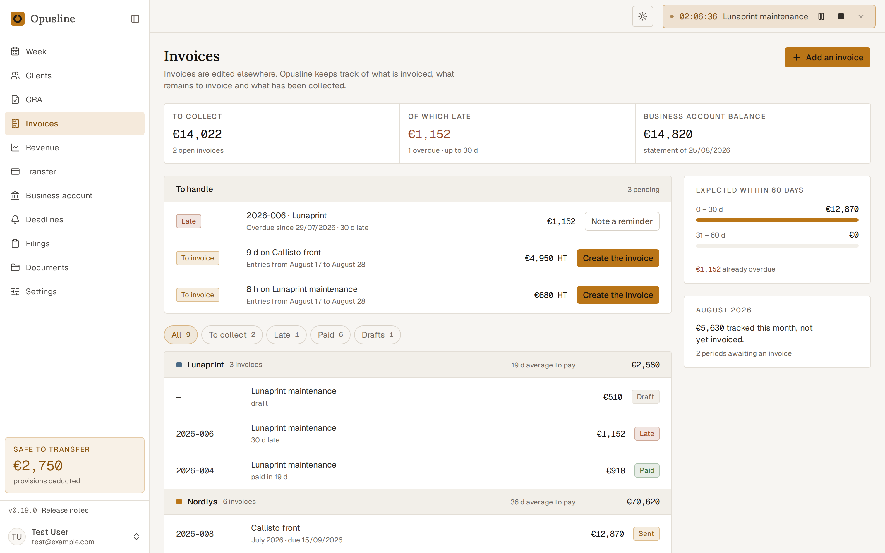
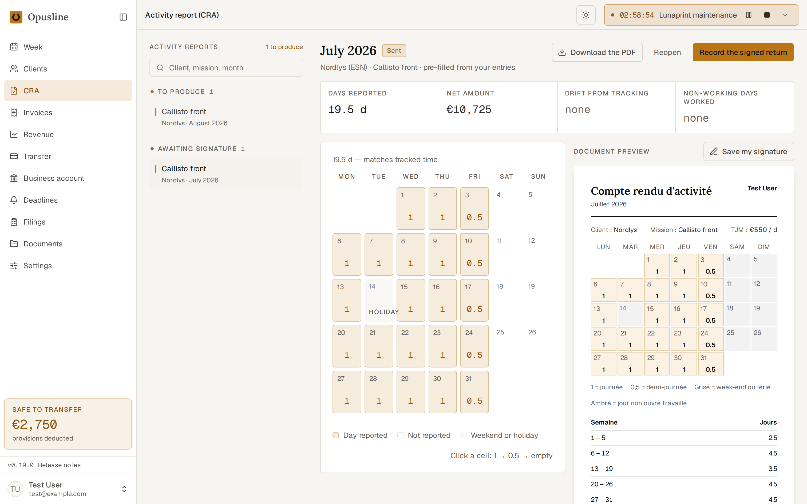
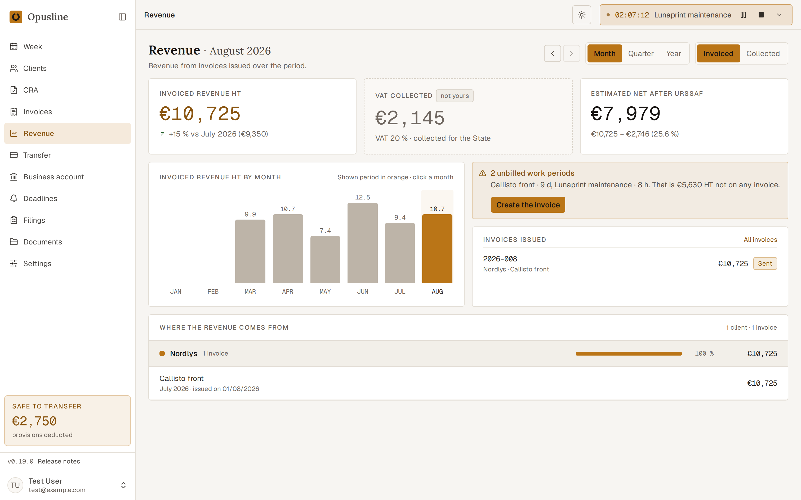
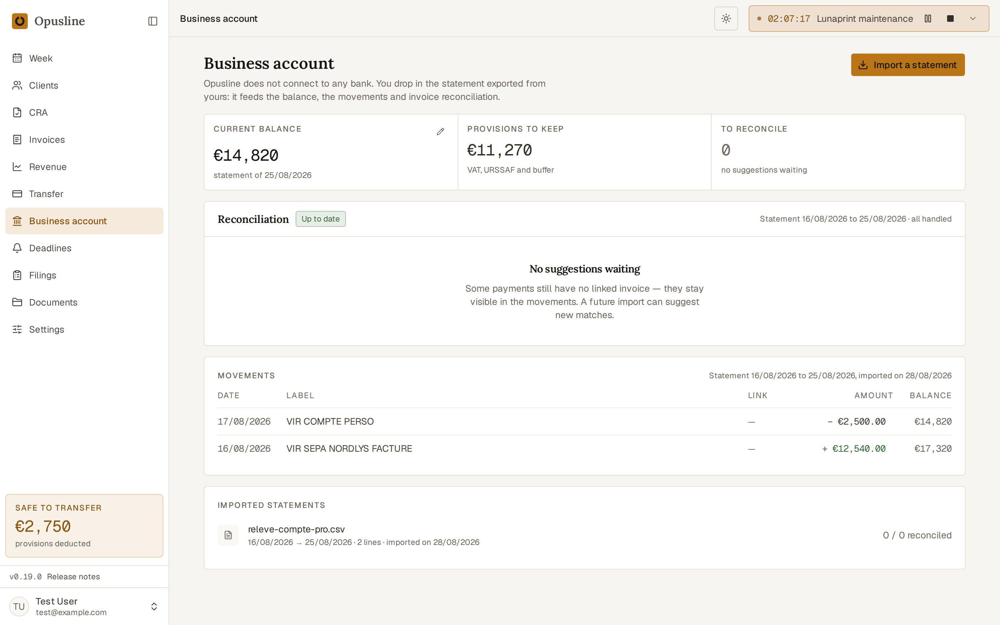

<div align="center">

# Opusline

**Time tracking, CRA, invoicing and French fiscal deadlines — for one freelance, self-hosted.**

An open-source alternative to Kimai, built freelance-first for the French market:
missions, TJM, CRA, URSSAF, TVA, and the one question that actually matters —
*how much can I pay myself this month?*

[](https://github.com/opusline/opusline/actions/workflows/ci.yml)
[](https://github.com/opusline/opusline/releases)
[](LICENSE)
[](docs/self-hosting.md)

</div>

> [!WARNING]
> **Pre-1.0.** Opusline is usable and in daily use by its author, but the schema,
> the API and the UI all still move between releases. Migrations run on upgrade
> and are tested, and there is no backport policy — read the release notes before
> pulling, and keep the backups
> [the self-hosting guide](docs/self-hosting.md#backups) describes.

---

## The week, and what it is worth

Track by the day or by the hour. Each mission bills in its own unit and rounds to
its own increment, so what the grid shows is what an invoice would carry.



## How much can I pay myself?

The question Opusline exists for. Your business balance, minus what the fisc is
owed but has not yet asked for — TVA collected, URSSAF on the period's
collections, the CFE nobody remembers, and whatever cushion you told it to keep.



## Fiscal deadlines that come to you

URSSAF, TVA and the CFE on one timeline, priced from what you actually collected —
cash basis, because that is how the micro-régime works. Subscribe to it from any
calendar app.



## Invoices, and the work behind them

Draft, sent, paid, late — with the tracked time each invoice covers, and forfait
budgets that tell you when a fixed price has eaten more days than it was worth.



## A CRA your client will accept

A monthly compte-rendu d'activité as a French PDF: signed, sent, and matched
against the time you tracked, so the two cannot quietly diverge.



## Revenue, invoiced or collected

Both bases, because they answer different questions — one is what you billed, the
other is what the URSSAF will ask about.



## Your business account, without connecting it

Drop in the statement your bank exports. Opusline parses CSV, OFX, QIF and
CAMT.053, suggests an invoice for each payment, and you validate in one click. It
never talks to your bank.



---

## Run your own

Two images, published to GHCR on every release. On a VPS, a home server or a NAS:

```bash
curl -O https://raw.githubusercontent.com/opusline/opusline/main/compose.prod.yaml
curl -o .env https://raw.githubusercontent.com/opusline/opusline/main/.env.production.example

# The one secret you must not lose.
docker run --rm ghcr.io/opusline/opusline-api php artisan key:generate --show
```

Put that key in `APP_KEY`, set `DB_PASSWORD`, point `APP_URL` at your hostname,
then:

```bash
docker compose -f compose.prod.yaml up -d
```

Migrations run on start, so that is the whole install. Open the app and register
the first account — Opusline is single-tenant, so that account is yours.

**[Full guide →](docs/self-hosting.md)** — the
[compose file in full](docs/self-hosting.md#the-compose-file), TLS, backups and
upgrades.

## What it is not

- **Not multi-tenant.** One instance, one freelance. No teams, no roles, no
  invitations.
- **Not a bank integration.** You export a statement; Opusline reads it. Nothing
  reaches out to your accounts.
- **Not an accountant.** It computes provisions and pre-fills declarations. It
  does not file them, and it is not advice.
- **Not general-purpose.** The fiscal machinery is French: URSSAF, CA3/CA12, CFE,
  micro-BNC. Track time anywhere; the tax half only applies in France.

## Built with

Laravel on FrankenPHP, a React SPA on TanStack Router and Query, shadcn/ui on
Base UI, Tailwind v4. Postgres, MySQL and SQLite all pass the test matrix. The web
app compiles to static files — there is no second server runtime to operate.

## Working on Opusline

Prerequisites: Node.js 22.12+ (or 20.19+) with pnpm, and Docker (PHP only runs in containers,
through `apps/api/scripts/php.sh`).

```bash
pnpm install        # JS workspaces + git hooks
pnpm dev            # api (Docker stack), web on :3000, storybook on :6006
cd apps/api && sh scripts/php.sh php artisan migrate --seed
```

`--seed` builds the demo account these screenshots were taken from
(`test@example.com` / `password`). Contributions welcome — see
[CONTRIBUTING.md](CONTRIBUTING.md), and [SECURITY.md](SECURITY.md) if you found
something that should not be filed in public.

The stack in `apps/api/compose.yaml` is for development only — it builds from
your host's `vendor/` and bind-mounts the repository. `compose.prod.yaml` is the
one that deploys.

## License

[AGPL-3.0](LICENSE). Run it, change it, host it — if you host a modified version
for others, share the changes.
